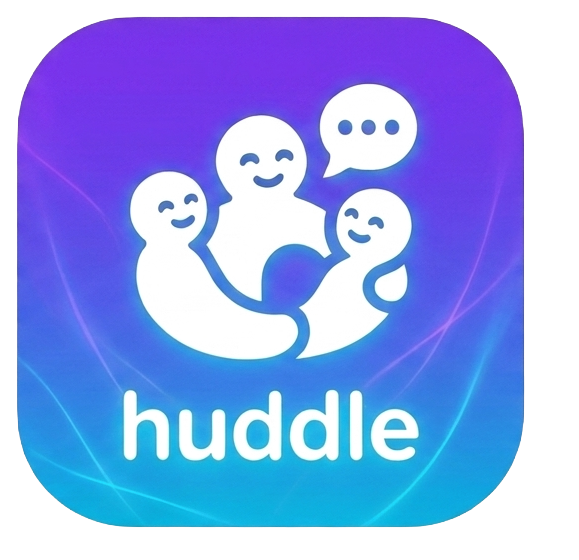

# 💬 Huddle

<p align="center">
  
</p>

<p align="center">
A modern real-time messaging application for Android built with <b>Kotlin</b>, <b>Firebase</b>, and <b>Material Design 3</b>.
</p>

---

## ✨ Features

- 🔐 Secure user authentication
- 👤 Unique user profile
- 🤝 Friend request system
- 💬 Real-time one-to-one messaging
- 👥 Group chat support
- 🖼️ Image sharing with Cloudinary
- 🌙 Dark & Light theme
- 🟢 Online status
- 🔍 Search users
- ⚡ Fast and clean Material Design 3 UI

---

## 📱 Screenshots

> Screenshots coming soon.

---

## 🛠 Tech Stack

| Technology | Purpose |
|------------|---------|
| Kotlin | Android Development |
| Firebase Authentication | User Authentication |
| Cloud Firestore | Real-time Database |
| Cloudinary | Image Storage |
| MVVM | App Architecture |
| Material Design 3 | UI/UX |
| Coil | Image Loading |
| Coroutines | Asynchronous Programming |

---

## 📂 Project Structure

```
app/
├── data/
├── di/
├── ui/
├── utils/
└── MainActivity.kt
```

---

## 🚀 Getting Started

### Clone the repository

```bash
git clone https://github.com/rohit-commits-ux/Huddle.git
```

Open the project using Android Studio.

### Configure Firebase

Add your own Firebase project and place:

```
app/google-services.json
```

inside the **app** folder.

### Configure Cloudinary

Create an **Unsigned Upload Preset** and update:

```
Constants.kt
```

with your:

- Cloud Name
- Upload Preset

---

## 📌 Current Features

- ✅ Authentication
- ✅ Friend Requests
- ✅ One-to-One Chat
- ✅ Group Chat
- ✅ Profile Management
- ✅ Image Upload
- ✅ User Search
- ✅ Material 3 Design
- ✅ Dark/Light Theme

---

## 🚧 Planned Features

- 🎤 Voice Messages
- 📞 Voice Calling
- 📹 Video Calling
- ❤️ Message Reactions
- ✏️ Edit Messages
- 🗑 Delete for Everyone
- 📍 Live Location Sharing
- 🔐 End-to-End Encryption
- 📂 File Sharing
- 🔎 Chat Search

---

## 🤝 Contributing

Contributions, suggestions, and bug reports are welcome.

Feel free to fork this repository and submit a pull request.

---

## 📄 License

This project is licensed under the MIT License.

---

## 👨‍💻 Developer

**Rohit Sil**

GitHub: https://github.com/rohit-commits-ux

---

⭐ If you like this project, consider giving it a **Star** on GitHub.
